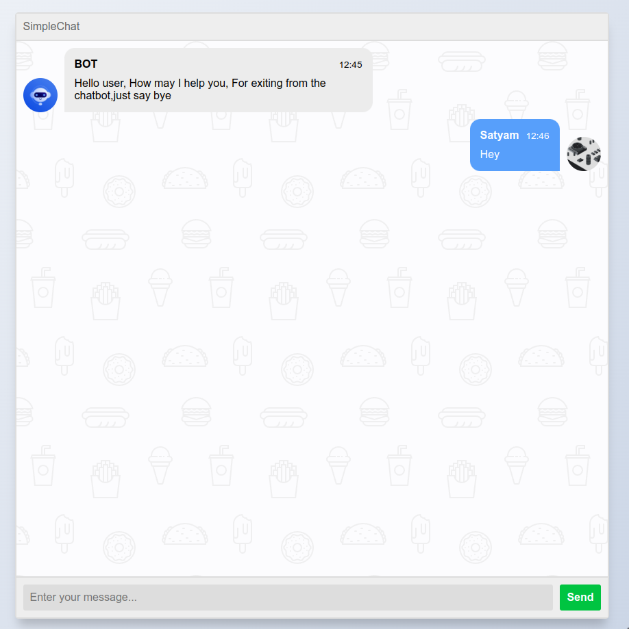
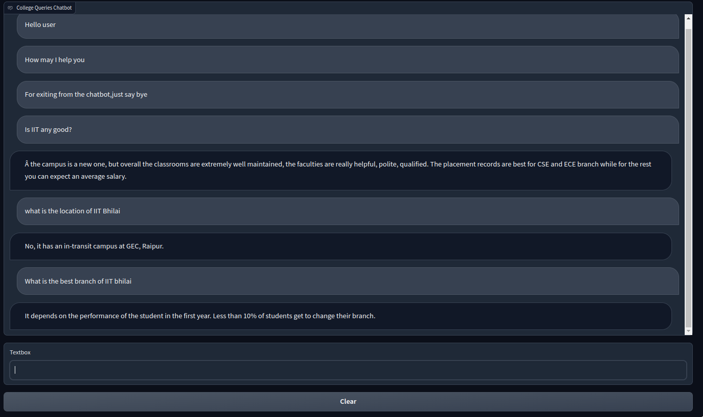

# Chatbot [NLP Project]

## Dataset
Corpus - Based on IIT Bhilai website.

QA dataset - We have created a custom dataset which includes the FAQ of IIT Bhilai. 

### Collection Procedure
#### IIT Bhilai Corpus
Downloaded the html files
```shell
wget \
     --recursive \
     --no-clobber \
     --page-requisites \
     --html-extension \
     --no-check-certificate \
     --convert-links \
     --restrict-file-names=unix \
     --domains iitbhilai.ac.in\
     --no-parent \
         https://www.iitbhilai.ac.in
````
From all the HTML files, we created the corpus.
```shell
for i in ${ls}
do
cat $i | pup 'div#content' text{} | sed '/^[[:space:]]*$/d' >> iit-corpus.txt
done
```
Cleaned the corpus from any `css` code.
#### QA Dataset
Scraped different websites like Quora, College-Dunia, etc.

## Frontend
Its made using [django](https://www.djangoproject.com/) framework.
To start the server. Please run
```shell
source chating/.env
python manage.py runserver
```


## Backend
### Baseline Model
We have used word vectors (Word2Vec, FastText) to determine the embedding of different questions, and then tried
to find the Word Mover's distance between the asked question and available questions, to give ans answer.


To run the chatbot, execute
```shell
python chatbot.py
```

### BERT Model
Using the custom dataset, we fine tuned the bart-base-uncased BERT model on Masked Language Modelling task to train it on the domain of IIT Corpus.
Using the fine tuned BERT model, we trained it on the custom QA dataset for our chatbot.

## Presentation
Please check the [ppt](./Group25.pdf) for more details.

## Members
1. [Satyam](https://github.com/satyams2812)
2. [Shahid](https://github.com/sowdagar3)
3. [Debarghya](https://github.com/deba-iitbh)
4. [Nikhil](https://github.com/nikhildotpy)
